# Weather Landscape Cloudflare Worker

This directory contains the Cloudflare Python Worker implementation for generating and serving weather landscape images.

## Architecture

### Event-Driven Multi-Worker Architecture

The system uses an event-driven architecture with **three specialized workers** connected via Cloudflare Queues:

```mermaid
flowchart TB
    subgraph Triggers["Event Triggers"]
        CRON["⏰ Cron Trigger<br/>(Every 15 min)"]
        HTTP["🌐 HTTP Request<br/>POST /admin/generate"]
    end

    subgraph Workers["Cloudflare Workers"]
        direction TB

        subgraph WebWorker["weather-landscape-web"]
            WEB["HTTP Request Handler<br/>• Serve images from R2<br/>• Admin dashboard<br/>• Manual generation"]
        end

        subgraph FetcherWorker["weather-fetcher"]
            FETCHER["Weather Data Fetcher<br/>• Process active ZIPs<br/>• Fetch weather data<br/>• Enqueue generation jobs"]
        end

        subgraph GeneratorWorker["landscape-generator"]
            GENERATOR["Image Generator<br/>• Consume queue messages<br/>• Generate ONE image<br/>• Upload to R2"]
        end
    end

    subgraph Queue["Cloudflare Queue"]
        JOBQUEUE["landscape-jobs<br/>• ZIP code<br/>• Format name<br/>• Weather data key"]
    end

    subgraph External["External Services"]
        OWM["OpenWeatherMap API<br/>• Geocoding<br/>• Current Weather<br/>• 5-Day Forecast"]
        R2["Cloudflare R2<br/>(Image Storage)"]
        KV["Cloudflare KV<br/>• Config & Metadata<br/>• Weather data cache"]
    end

    subgraph Generation["Image Generation Core"]
        WL["WeatherLandscape<br/>(Orchestrator)"]
        DW["DrawWeather<br/>(Renderer)"]
        SPRITES["Sprites System<br/>(RGB & B&W)"]
    end

    %% Trigger flows
    CRON --> FETCHER
    HTTP --> WEB

    %% Weather fetcher flow
    FETCHER <--> KV
    FETCHER <--> OWM
    FETCHER -->|"Enqueue jobs"| JOBQUEUE

    %% Generator flow
    JOBQUEUE -->|"Consume"| GENERATOR
    GENERATOR <--> KV
    GENERATOR --> WL
    WL --> DW
    DW --> SPRITES
    GENERATOR -->|"Upload"| R2

    %% Web worker flow
    WEB <--> R2
    WEB <--> KV
    WEB -->|"Manual gen"| JOBQUEUE

    classDef trigger fill:#e1f5fe,stroke:#01579b
    classDef worker fill:#f3e5f5,stroke:#4a148c
    classDef queue fill:#fff9c4,stroke:#f57f17
    classDef external fill:#fff3e0,stroke:#e65100
    classDef core fill:#e8f5e9,stroke:#1b5e20

    class CRON,HTTP trigger
    class WEB,FETCHER,GENERATOR worker
    class JOBQUEUE queue
    class OWM,R2,KV external
    class WL,DW,SPRITES core
```



### Detailed Data Flow

```mermaid
sequenceDiagram
    participant Cron as ⏰ Cron Trigger
    participant Fetcher as weather-fetcher
    participant KV as KV Store
    participant OWM as OpenWeatherMap
    participant Queue as landscape-jobs
    participant Generator as landscape-generator
    participant R2 as R2 Storage

    Note over Cron,R2: Every 15 minutes

    Cron->>Fetcher: Trigger scheduled event

    Fetcher->>KV: Get active_zips
    KV-->>Fetcher: ["78729", "90210", ...]

    loop For each ZIP code
        Fetcher->>KV: Get geo:{zip} (cached)
        KV-->>Fetcher: {lat, lon}

        alt Not cached
            Fetcher->>OWM: Geocode ZIP
            OWM-->>Fetcher: {lat, lon}
            Fetcher->>KV: Cache geo:{zip}
        end

        Fetcher->>OWM: Fetch weather (lat, lon)
        OWM-->>Fetcher: Weather data

        Fetcher->>KV: Store weather:{zip} (TTL: 20min)

        Fetcher->>KV: Get formats:{zip}
        KV-->>Fetcher: ["rgb_light", "bw", ...]

        loop For each format
            Fetcher->>Queue: Enqueue {zip, format}
        end
    end

    Note over Queue,R2: Parallel processing

    par Process queue messages
        Queue->>Generator: Message {zip, format}
        Generator->>KV: Get weather:{zip}
        KV-->>Generator: Weather data
        Generator->>Generator: Generate image
        Generator->>R2: Upload {zip}/{format}.ext
        Generator->>KV: Update metadata:{zip}:{format}
    end
```



### Benefits of Multi-Worker Architecture

| Aspect | Old (Monolithic) | New (Event-Driven) |
|--------|------------------|-------------------|
| **Runtime** | O(zips × formats) | O(1) per job |
| **Parallelism** | Sequential | Concurrent queue consumers |
| **Fault Tolerance** | All-or-nothing | Per-image retry |
| **Scaling** | Linear degradation | Automatic queue scaling |
| **Resource Isolation** | Shared CPU time | Dedicated per worker |
| **Debugging** | Complex traces | Clear job boundaries |

### Secure Architecture & Route Layout

The application implements Zero Trust security with Cloudflare Access protecting administrative endpoints:

```mermaid
flowchart TB
    subgraph Internet["Internet"]
        USER["👤 User"]
        ADMIN["👨‍💼 Administrator"]
    end

    subgraph CloudflareEdge["Cloudflare Edge Network"]
        direction TB

        subgraph DNS["DNS & Routing"]
            DOMAIN["Custom Domain<br/>(weather.example.com)"]
        end

        subgraph Security["Security Layer"]
            ACCESS["🔐 Cloudflare Access<br/>(Zero Trust)"]
        end

        subgraph Worker["Cloudflare Worker"]
            ROUTER["Request Router<br/>(index.py)"]

            subgraph PublicRoutes["Public Routes (No Auth)"]
                LANDING["/ <br/>Landing Page"]
                FORECASTS["/forecasts<br/>ZIP Code List"]
                GUIDE["/guide<br/>Reading Guide"]
                ZIPIMG["/{zip}<br/>Weather Image"]
                ZIPFMT["/{zip}?{format}<br/>Specific Format"]
                ASSETS["/assets/*<br/>Static Assets"]
                FAVICON["/favicon.png"]
                EXAMPLE["/example"]
            end

            subgraph ProtectedRoutes["Protected Routes (Auth Required)"]
                ADMINDASH["/admin<br/>Dashboard"]
                ADMINSTATUS["/admin/status<br/>Gen Status"]
                ADMINACT["/admin/activate<br/>Activate ZIP"]
                ADMINDEACT["/admin/deactivate<br/>Deactivate ZIP"]
                ADMINGEN["/admin/generate<br/>Manual Gen"]
                ADMINFMTADD["/admin/formats/add"]
                ADMINFMTREM["/admin/formats/remove"]
                ADMINFMTGET["/admin/formats/get"]
            end
        end
    end

    subgraph Storage["Storage Layer"]
        R2DB[("R2 Bucket<br/>weather-landscapes")]
        KVDB[("KV Namespace<br/>CONFIG")]
    end

    USER --> DOMAIN
    ADMIN --> DOMAIN
    DOMAIN --> ROUTER

    ROUTER --> PublicRoutes
    ROUTER --> ACCESS
    ACCESS -->|"✓ Authenticated"| ProtectedRoutes
    ACCESS -->|"✗ Denied"| REJECT["403 Forbidden"]

    PublicRoutes --> R2DB
    PublicRoutes --> KVDB
    ProtectedRoutes --> R2DB
    ProtectedRoutes --> KVDB

    classDef internet fill:#ffebee,stroke:#b71c1c
    classDef edge fill:#e3f2fd,stroke:#0d47a1
    classDef public fill:#e8f5e9,stroke:#1b5e20
    classDef protected fill:#fff3e0,stroke:#e65100
    classDef storage fill:#f3e5f5,stroke:#4a148c
    classDef security fill:#fce4ec,stroke:#880e4f

    class USER,ADMIN internet
    class DOMAIN,ROUTER edge
    class LANDING,FORECASTS,GUIDE,ZIPIMG,ZIPFMT,ASSETS,FAVICON,EXAMPLE public
    class ADMINDASH,ADMINSTATUS,ADMINACT,ADMINDEACT,ADMINGEN,ADMINFMTADD,ADMINFMTREM,ADMINFMTGET protected
    class R2DB,KVDB storage
    class ACCESS security
```



**Security Notes:**
- `workers_dev = false` and `preview_urls = false` disable public Cloudflare subdomains
- All traffic routes through custom domain with Cloudflare Access
- Zero Trust authentication occurs at edge level (before Worker code executes)
- Admin routes require successful authentication; public routes are open
- API keys stored securely in Cloudflare Secrets (not KV)

## Structure

```
src/
├── workers/                    # Worker entry points
│   ├── web.py                  # Web request handler (HTTP routes)
│   ├── weather_fetcher.py      # Cron-triggered weather fetcher
│   └── landscape_generator.py  # Queue consumer for image generation
├── shared/                     # Shared utilities
│   ├── __init__.py
│   ├── config.py               # WorkerConfig and format definitions
│   ├── kv_utils.py             # KV operations (geocoding, formats, etc.)
│   ├── r2_utils.py             # R2 upload operations
│   └── image_utils.py          # Image generation utilities
├── templates/                  # HTML templates (string.Template format)
│   ├── landing.html            # Homepage (/)
│   ├── forecasts.html          # ZIP code list (/forecasts)
│   ├── guide.html              # Reading guide (/guide)
│   └── admin.html              # Admin dashboard (/admin)
├── assets/                     # Static assets bundled with worker
│   ├── styles.css              # Shared stylesheet
│   ├── diagram.png             # Weather encoding diagram
│   └── favicon.png             # Site icon (RGB house sprite)
├── index.py                    # Legacy entry point (deprecated)
└── README.md                   # This file
```

### Worker Entry Points

Each worker has its own entry point in `src/workers/`:

- **web.py**: Handles all HTTP requests (landing page, forecasts, admin, images)
- **weather_fetcher.py**: Runs on cron, fetches weather data, enqueues jobs
- **landscape_generator.py**: Consumes queue, generates and uploads images

## How It Works

The worker provides three main functions:

### 1. Web Interface
Serves a complete web UI with templating:
- **Templating**: Uses Python's built-in `string.Template` (no external dependencies)
- **Shared CSS**: All pages reference `/assets/styles.css`
- **Responsive Design**: Mobile-first with hamburger menu navigation
- **Routes**:
  - `/` - Landing page with project explanation
  - `/forecasts` - Card-based list of ZIP codes and formats
  - `/guide` - Comprehensive reading guide
  - `/admin` - Management dashboard
  - `/assets/*` - Static assets (CSS, images)

### 2. Scheduled Generation (Cron)
- Runs every 15 minutes (configurable in `wrangler.toml`)
- Processes all active ZIP codes from KV (`active_zips`)
- For each ZIP:
  - Fetches weather from OpenWeather API
  - Generates images in all configured formats
  - Uploads to R2 at `{zip}/{format}.{ext}`
  - Updates metadata in KV
- Supports multi-format generation per ZIP

### 3. Image Serving & API
- `GET /{zip}` - Serves latest image (default format)
- `GET /{zip}?{format}` - Serves specific format
- `GET /admin/status` - Returns generation status and metadata
- `POST /admin/generate?zip={zip}` - Manually triggers generation
- `POST /admin/activate?zip={zip}` - Activates ZIP for auto-generation
- `POST /admin/deactivate?zip={zip}` - Deactivates ZIP
- `POST /admin/formats/add` - Adds format to ZIP
- `POST /admin/formats/remove` - Removes format from ZIP

## Key Components

### `index.py`

**Main Worker Class:**
```python
class WeatherLandscapeWorker:
    async def on_fetch(self, request, env, ctx):
        # Handles all HTTP requests and routing

    async def scheduled(self, event, env, ctx):
        # Handles cron-triggered generation
```

**Templating Functions:**
```python
def load_template(template_name):
    # Loads HTML template from src/templates/

def render_template(template_name, **context):
    # Renders template with $variable substitution
```

**Environment Bindings:**
- `env.WEATHER_IMAGES` - R2 bucket for images
- `env.CONFIG` - KV namespace for configuration
- `env.OWM_API_KEY` - OpenWeather API key (secret)
- `env.DEFAULT_ZIP` - Fallback ZIP code

### Templating System

**Why string.Template?**
- Built-in to Python (no external dependencies)
- Works in Cloudflare Workers' Pyodide environment
- Lightweight and fast
- Simple `$variable` syntax

**Template Variables:**
Templates use `$variable` syntax for substitution:
```html
<h1>Available Forecasts ($zip_count)</h1>
<div class="zip-grid">
    $zip_links
</div>
```

**Rendering:**
```python
html = render_template('forecasts.html',
    zip_links=cards_html,
    zip_count=len(all_zips)
)
```

**JavaScript in Templates:**
Dollar signs in JavaScript must be escaped as `$$`:
```javascript
// In template:
const regex = /^\d{5}$$/;  // Note: $$ instead of $
```

### Asset Bundling

**wrangler.toml Configuration:**
```toml
# HTML templates as Text
[[rules]]
type = "Text"
globs = ["src/templates/*.html"]

# CSS as Text
[[rules]]
type = "Text"
globs = ["**/*.css"]

# Images as Data (binary)
[[rules]]
type = "Data"
globs = ["**/*.png", "**/*.bmp"]
```

**Serving Assets:**
Assets are served with proper content-type and caching:
```python
# CSS
return Response.new(css_content, headers={
    "content-type": "text/css; charset=UTF-8",
    "cache-control": "public, max-age=86400"
})

# Images (binary conversion required)
from js import Uint8Array
js_array = Uint8Array.new(len(image_bytes))
for i, byte in enumerate(image_bytes):
    js_array[i] = byte
```

## Dependencies

The worker uses the existing weather landscape generation code from the parent directory:

```python
from weather_landscape import WeatherLandscape
from configs import WLConfig_RGB_White
from p_weather.openweathermap import OpenWeatherMap
from p_weather.draw_weather import DrawWeather
```

## Local Development

```bash
# Install Wrangler CLI
npm install -g wrangler

# Run web worker locally
wrangler dev

# Test the worker
curl http://localhost:8787/
curl http://localhost:8787/admin/status
```

## Deployment

The system uses three separate workers that must be deployed individually:

### 1. Create Queue (first time only)
```bash
wrangler queues create landscape-jobs
wrangler queues create landscape-jobs-dlq  # Dead letter queue
```

### 2. Deploy Workers

```bash
# Deploy web worker (HTTP handling)
wrangler deploy

# Deploy weather fetcher (cron-triggered)
wrangler deploy -c wrangler.fetcher.toml

# Deploy landscape generator (queue consumer)
wrangler deploy -c wrangler.generator.toml
```

### 3. Set Secrets for Each Worker

```bash
# Web worker
wrangler secret put OWM_API_KEY

# Weather fetcher
wrangler secret put OWM_API_KEY -c wrangler.fetcher.toml

# Landscape generator
wrangler secret put OWM_API_KEY -c wrangler.generator.toml
```

### Important Notes

- All three workers share the same KV namespace and R2 bucket
- The queue `landscape-jobs` connects the fetcher to the generator
- Update `YOUR_KV_NAMESPACE_ID` in all three wrangler configs with your actual KV namespace ID
- See `../DEPLOYMENT.md` for complete deployment instructions

## Beta Limitations

⚠️ **Python Workers are in beta (as of Jan 2025)**

- Packages like Pillow work in local dev but may not deploy to production
- Only Python standard library is guaranteed to work in production
- Worker bundle size may exceed limits with large packages

See `../DEPLOYMENT.md` for workarounds and alternatives.

## Configuration

### Secrets (set via wrangler)
```bash
wrangler secret put OWM_API_KEY
wrangler secret put DEFAULT_LAT  # optional
wrangler secret put DEFAULT_LON  # optional
```

### Environment Variables (in wrangler.toml)
```toml
[vars]
DEFAULT_LAT = 52.196136
DEFAULT_LON = 21.007963
IMAGE_WIDTH = 296
IMAGE_HEIGHT = 128
```

### KV Configuration
```bash
# Set image variant
wrangler kv:key put --namespace-id YOUR_ID "config:variant" "rgb_white"
```

## Monitoring

```bash
# Stream logs
wrangler tail

# Check R2 files
wrangler r2 object list weather-landscapes

# Check KV data
wrangler kv:key list --namespace-id YOUR_ID
```

## Troubleshooting

### Common Issues

1. **"Module not found" errors**
   - Ensure parent directory modules are accessible
   - Check Python path configuration

2. **"OWM_API_KEY not set"**
   - Set secret: `wrangler secret put OWM_API_KEY`

3. **Pillow import fails in production**
   - Expected beta limitation
   - Monitor [Python Workers changelog](https://developers.cloudflare.com/workers/languages/python/)

## Future Enhancements

Potential improvements once Python Workers exit beta:

- [ ] Support multiple image variants (configurable via KV)
- [ ] Support multiple locations (per-location endpoints)
- [ ] Archive historical images to R2
- [ ] Add webhook notifications on generation
- [ ] Implement image comparison (only upload if changed)
- [ ] Add custom event overlays (holidays, birthdays)

## References

- [Cloudflare Python Workers](https://developers.cloudflare.com/workers/languages/python/)
- [R2 Documentation](https://developers.cloudflare.com/r2/)
- [Workers KV](https://developers.cloudflare.com/kv/)
- [Parent Project README](../README.md)
